## 👑 팀명 : 반갈죽🤦‍♂️ 
<!-- 

 -->

 
### 🐿️ 팀원

|안준용|이호재|
|:---:|:---:|
|| |
|[@JunYongAn](https://github.com/yongjunan111)|[@HoJL](https://github.com/HoJL)|
|**Project Leader** AI Engineer|AI Enginner Full Stack|

### 🎖️ 프로젝트 개요
자체 SLLM을 활용한 사내문서 검색 시스템

### 🎖️프로젝트 기획 배경
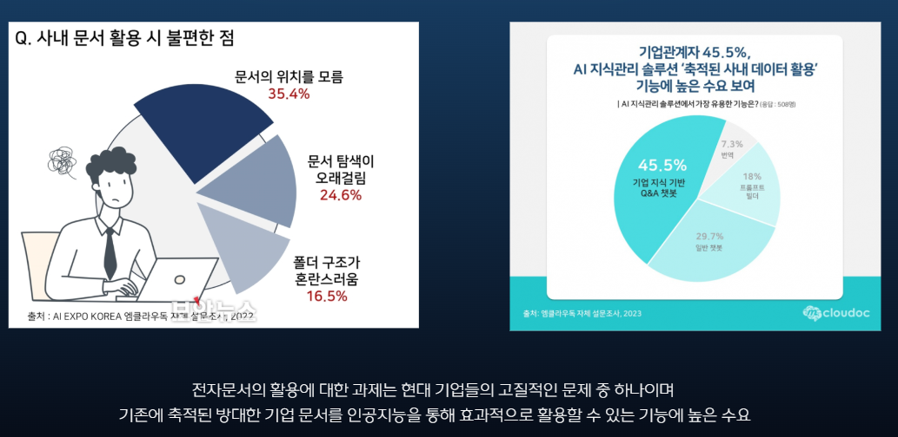

### 🎖️ 프로젝트 목표 및 기대효과

#### 목표
파인튜닝 적용한 sLLM 을 활용해서 Agent 형 RAG Application 을 구축
직원들의 정보검색시간을 단축하여 업무 효율성 향상을 기대
#### 기대효과
서비스 구축을 통해 신속한 업무정보 제공
회사의 업무 효율성 향상 및 시간 절약
자원 관리를 최적화하고, 회사의 생산성을 높이는 데 중요한 역할

### 🔨 기술 스택

 

### 📅 WBS
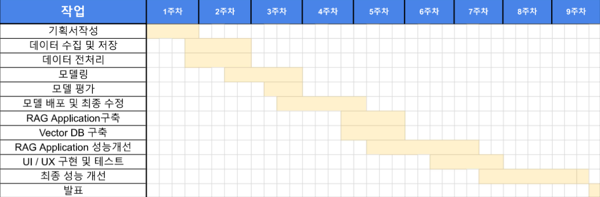

### ✏️ System Architecture

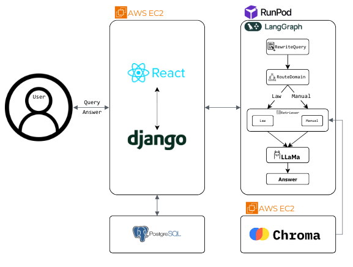  

### 👨🏻‍💻 수행 결과

1. 데이터 수집 및 전처리

- 수집한 데이터 
    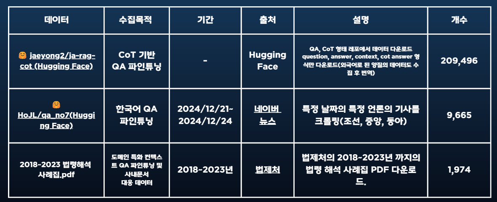 
- 전처리 
    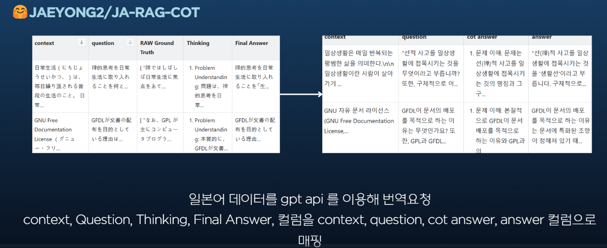 
    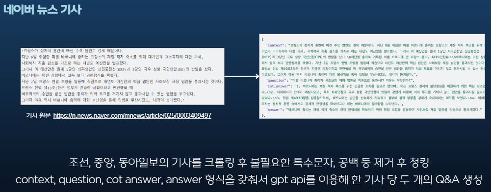 
    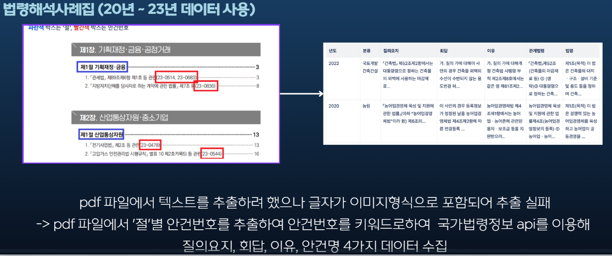 

2. Rag Application

- Vector DB 
    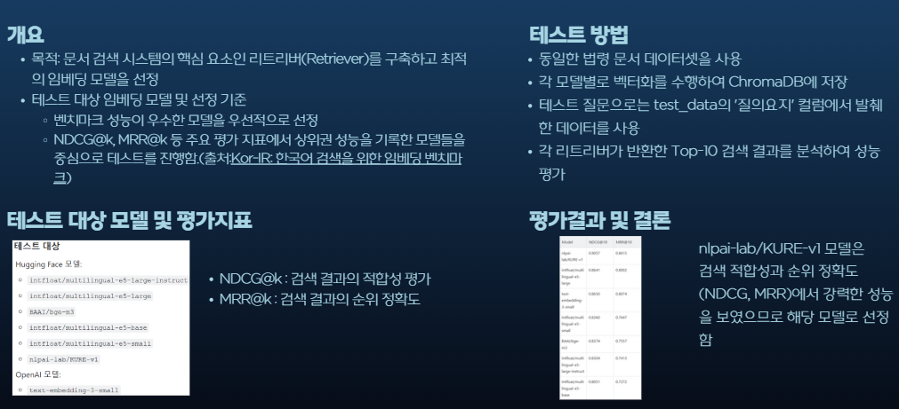 
- Langgraph 
    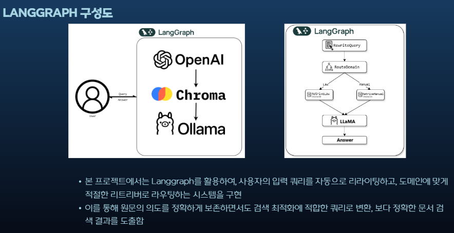 

3. Fine Tuning

- 베이스라인 모델 선정 
    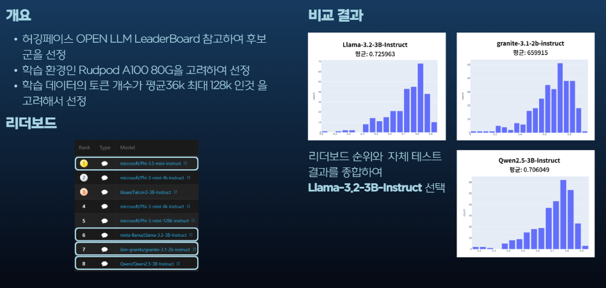 
- context QA 파인튜닝 
    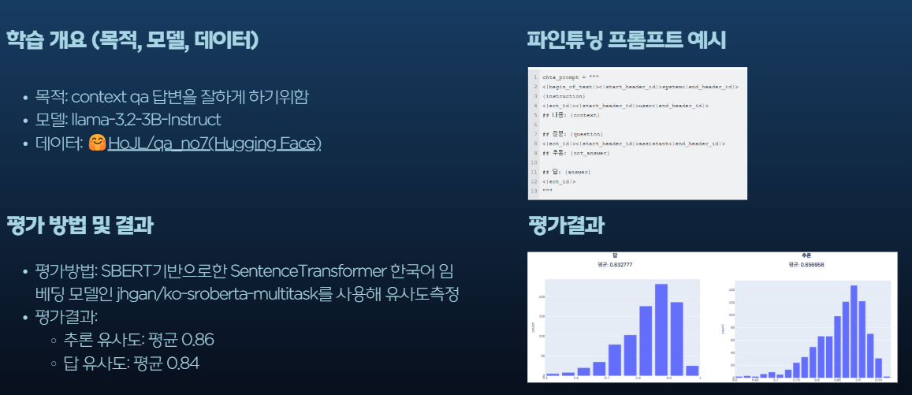 
- 도메인 특화 파인튜닝 
    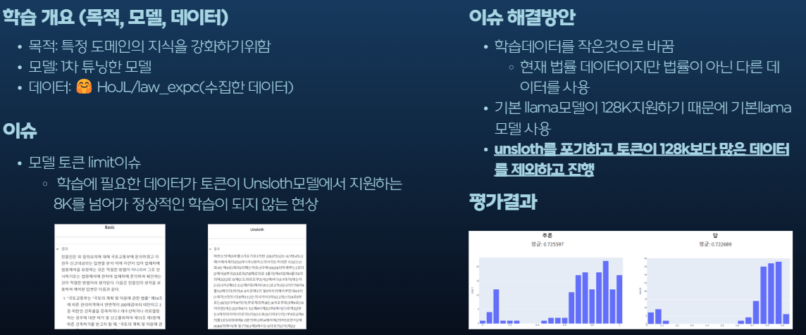 
 
    

4. 시연화면

- [시연영상.mp4](./docs/발표/시연연상.mp4) 
    

### 한 줄 회고

안준용 - 처음으로 sLLM 프로젝트를 기획부터 구현까지 진행해봤는데 배운점이 정말 많고 데이터가 중요하다는 생각이 많이 들었습니다.
  
이호재 - 프로젝트를 진행하면서 써야할 문서가 많고 디테일하게 적어야 하는부분이 많아서 '문서가 프로젝트의 절반'이다 라는것을 깨달았습니다. 
